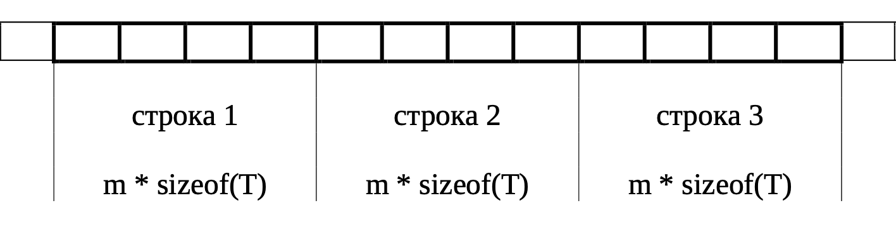
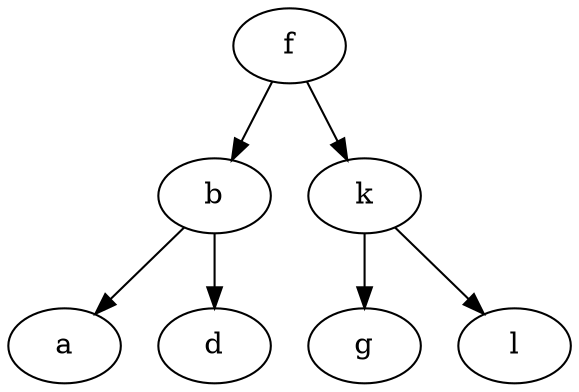

{{TOC}}

<head>
  <style>
    h1 
    {
      color: red;
    }
    h2 
    {
      color: orange;
    }
    h3, h4, h5, h6 
    {
      color: red;
    }
    a 
    {
      text-decoration: none;
    }
  </style>
</head>

# **Указатель на void. Стандартные функции обработки областей памяти.** [🔼](#top)

## **Указатель на void.** [🔼](#top)

Тип указатель `void` (обобщённый указатель) используется при неизвестном типе объекта:
- Cсылка на произвольный участок памяти, вне зависимости от расположенных там объектов:

```C
double d = 5.0;
char c = 'c';

void *pd = &d;
void *pc = &c;
```
- Передача в функцию указателя на объект любого типа.
```C
ptrdiff_t cmp_int(const void *l, const void *r)
{	
	const int *pl = l;
	const int *pr = r;

	return *pl - *pr;
}

...

qsort(arr, sizeof(arr) / sizeof(arr[0]),
sizeof(int), cmp_int);
```

**Особенности:**

В языке Си допускается присваивание `void*` указателю любого другого типа (и наоборот) без явного преобразования типа указателя:

```C
double d = 5.0;
double *pd = &d;
void *pd = pd;

pd = pv;
```
 `void*` нельзя разыменовывать:
 
```C
double d = 5.0;
void *pv = &d;

// ERR: fpritnf(stdout, "%lf", *pv);
fputc(NEWLINE, stdout);
```
 К `void*` не применима адресная арифметика:
 
```C
 double d = 5.0;
 void *pv = &d;
 
 // ERR: pv++;
```


## **Стандартные функции обработки областей памяти.** [🔼](#top)

`memcmp`

**Описание:**

Лексикографически сравнивает первые `n` байт объектов, на которые указывают `s1` и `s2`.
- `rc < 0` — первый отличающийся байт в `s1` меньше, чем в `s2`;
- `rc == 0` — первые `n` байт в `s1` и `s2` идентичны;
- `rc > 0` — первый отличающийся байт в `s1` больше, чем в `s2`.

**Прототип:**

```C
#include <string.h>

int memcmp(const void *s1, const void *s2, 
size_t n);
```

**Пример:**
```C
int arr1[10] = { 1, 2, 3, 4, 5};
int arr2[10] = { 1, 2, 3, 4, 6};

int rc = memcmp(arr1, arr2, 5);
```

`memmove`

**Описание:**

- Копирует `n` символов из объекта, на который указывает  `s2` в объект, на который указывает `s1`;
- Копирование происходит путём создания временного массива из `n` символов объекта, на который указывает `s2`;
- Массив не перекрывает объекты, на которые указывают `s1` и `s2`;
- Далее из временного массива данные копируются в объект, на который указывает `s1`.

**Прототип:**
```C
#include <string.h>

void *memmove(void *s1, const void *s2,
size_t n);
```

**Пример:**
```C
char str1[10] = "foo";
char str2[10] = "f";

memmove(str1 + strlen(str1), str2,
strlen(str2));
```

`memcpy`

**Описание:**

Копирует `n` символов из объекта, на который указывает `s2`, в объект на который указывает `s1`. Объекты перекрыты — поведение неопределенно.

**Прототип:**

```C
#include <string.h>

void *memcpy(void *restrict s1,
const void *restrict s2, size_t n);
```

**Пример:**
```C
char str1[5] = "foo";
char str2[5];

memcpy(str2, str1, strlen(str1) + 1);
```

`memset`

**Описание:**

Копирует значение `c` (преобразованное в беззнаковый символ) в каждый из первых `n` символов объекта, на который указывает `s`.

**Прототип:**

```C
#include <string.h>

void *memset(void *s, int c, size_t n);
```

**Пример:**
```C
char str[10];

memset(str, '*', sizeof(str) - 1);
str[sizeof(str) - 1] = NULL_CHAR;
```

<div style="page-break-after: always;"></div>

# **Функции динамического выделения памяти.** [🔼](#top)

**Общие «свойства» функций `malloc`, `calloc`, `realloc`.**

- Указанные функции не создают переменную, а лишь выделяют область памяти.  Результат — адрес расположения этой области в памяти компьютера, т. е. указатель.
- Ни одна из функций не знает тип располагаемых данных в выделенном блоке и возвращается указатель на `void`.
- Блок памяти не удалось выделить — `NULL`.
- После использования блок памяти надо освободить при помощи `free`.

`malloc`

**Описание:**

Выделяет место для объекта размером `size` без инициализации.

**Прототип:**

```C
#include <stdlib.h>

void *malloc(size_t size);
```

`calloc`

**Описание:**

Выделяет место для массива объектов размером `nmemb`, каждый из которых имеет размер `size`, c инициализацией нулевыми битами.

**Прототип:**

```C
#include <stdlib.h>

void *calloc(size_t nmemb, size_t size);
```

`free`

**Описание:**

Деаллоцирует пространство, на которое указывает `ptr`, делая его доступным для дальнейшего выделения.

- `ptr == NULL` — ничего не происходит.
- `ptr` указывает на объект, полученный минуя `calloc`, `malloc`, `realloc` — поведение неопределенно (как и в `realloc`).

**Прототип:**

```C
#include <stdlib.h>

void free(void *ptr);
```

`realloc`

**Описание:**

Деаллоцирует объект, на который указывает `ptr` и возвращает указатель на новый объект размером `size`

- `ptr == NULL` и `size != 0` — аналог `malloc`;
- `ptr != NULL` и `size == 0`  — аналог `free`;
- `ptr != NULL` и `size != 0` — `realloc` перевыделяет ранее выделенный блок памяти, на который указывает `ptr`, делая его размер равным `size` байт.  В худшем случае алгоритм таков:
- выделить новую область памяти;
- скопировать данные из старой в новую область;
- освободить старую область.

**Прототип:**

```C
#include <stdlib.h>

void *realloc(void *ptr, size_t size);
```

**Типичная ошибка вызова `realloc`.**

Запрашиваемый блок памяти выделить не удалось, `realloc` вернула `NULL`, однако `ptr` не будет освобождён. Во избежание используем временную переменную.

```C
// ERR: pa = realloc(pa, 2 * n);
void *temp = realloc(pa, 2 * n);

if (temp != NULL)
{
	pa = temp;
}
else
{
	// Обработка ошибочной ситуации
}
```

**Функция выделения памяти и явное приведение типа: за и против.**

```C
int *arr = (int *)malloc(n * sizeof(int));
```

| Плюсы                                                       | Минусы                                            |
|----------------------|---------------------------------------------|
| Компиляция с помощью C++ компилятора.                        | Начиная с ANSI C приведение не нужно.                       |
| У функции `malloc` до стандарта ANSI C был другой прототип:<br> `char *malloc(size_t size);` | Может скрыть ошибку, если забыли подключить `<stdlib.h>`.      |
| Дополнительная «проверка» аргументов разработчиком.         | В случае изменения типа указателя придётся менять тип в приведении. |

**Особенности выделения 0 байт памяти.**

Результат вызова функций `malloc`, `calloc` или `realloc` при запросе нулевого размера блока зависит от реализации:
- вернется `NULL`;
- вернется «нормальный» указатель, но его нельзя будет использовать для разыменования.

Поэтому перед вызовом этих функций нужно убедиться в запросе ненулевого размера блока.

<div style="page-break-after: always;"></div>

# **Выделения памяти под динамический массив. Типичные ошибки при работе с динамической памятью.**[🔼](#top)

**Способы возвращения динамического массива из функции.**

- Как возвращаемое значение:
```C
int *create_array(FILE *f, size_t *n);

...

int *arr;
size_t n;
arr = create_array(f, &n);
```
- Как параметр функции:
```C
int create_array(FILE *f, int **arr, size_t *n);

...

int *arr, rc;
size_t n;
rc = create_array(f, &arr, &n);
```

**Типичные ошибки при работе с динамической памятью.**

- Неверный расчёт количества динамической памяти:
```c
char *str;
str = malloc(5);
strcpy(str, "Hello");
```
- Отсутствие проверки успешности выделения памяти:
```c
int *arr;
arr = malloc(10000 * sizeof(int));
arr[0] = 5;
```
- Утечки памяти:
```c
int *arr;
arr = malloc(5);
...
// ERR: Не освободили
```

**Логические ошибки:**
- Дикий указатель:
```c
int *ptr;
*ptr = 5;
```
- Висячий указатель:
```c
int *ptr;
ptr = malloc(sizeof(int));
free(ptr);
*ptr = 5;
```
- Изменение указателя, возвращенного функцией выделения памяти:
```c
int *ptr;
ptr = malloc(5 * sizeof(int));
ptr++;
free(ptr);
```
- Двойное освобождение памяти:
```c
int *ptr;
ptr = malloc(5 * sizeof(int));
free(ptr);
free(ptr);
```
- Освобождение невыделенной или нединамической памяти:
```c
int x;
free(&x);
```
- Выход за границы динамического массива:
```c
int *arr;
arr = malloc(5 * sizeof(int));
arr[5] = 42;
```
И прочее...

**Подходы к обработке ситуации отсутствия свободной памяти при выделении.**

1. Возвращение ошибки — функция выделения памяти возвращает специальный код в случае неудачи (например,`NULL` в `malloc`, `calloc`, `realloc`);
2. Ошибка сегментации — неудача выделения памяти игнорируется, разыменовывание `NULL` вызывает ошибку.
3. Аварийное завершение — реализация функции обёртки `xmalloc`, которая в случае неудачи вызывает `abort()` или `exit()`;
4. Восстановление — попытка освобождения ранее выделенной памяти или уменьшение использованния ресурсов для повторного выделения памяти. (например `xmalloc` из `git`).

- Как возвращаемое значение:
```c
int *create_array(FILE *f, size_t *n)
{
    int *arr = NULL;
    int rc = 0;

    if (f == NULL || n == NULL)
    {
        rc = 1;
    }
    else
    {
        *n = 0;
        int tmp;

        while (fscanf(f, "%d", &tmp) == 1)
        {
            (*n)++;
        }

        rewind(f);

        if ((arr = malloc((*n) * sizeof(int))) == NULL)
        {
            rc = 1;
        }
        else
        {
            for (size_t i = 0; i < *n && rc == 0; i++)
            {
                if (fscanf(f, "%d", &arr[i]) != 1)
                {
                    free(arr);
                    arr = NULL;
                    rc = 1;
                }
            }
        }
    }

    return (rc == 0 ? arr : NULL);
}
```

- Как параметр функции:
```c
int create_array(FILE *f, int **arr, size_t *n)
{
    int rc = 0;

    if (f == NULL || arr == NULL || n == NULL)
    {
        rc = 1;
    }
    else
    {
        *n = 0;
        int tmp;

        while (fscanf(f, "%d", &tmp) == 1)
        {
            (*n)++;
        }

        rewind(f);

        if ((*arr = malloc((*n) * sizeof(int))) == NULL)
        {
            rc = 1;
        }
        else
        {
            for (size_t i = 0; i < *n && rc == 0; i++)
            {
                if (fscanf(f, "%d", &((*arr)[i])) != 1)
                {
                    free(*arr);
                    *arr = NULL;
                    rc = 1;
                }
            }
        }
    }

    return rc;
}
```

<div style="page-break-after: always;"></div>

#  **Указатели на функции. Функция `qsort`.**[🔼](#top)

Указатели на функцию используются для передачи одной функции в качестве параметра другой функции.

С помощью указателей на функцию реализуются:
- Функции обратного вызова — передача исполняемого кода в качестве одного из параметров другого кода;
- Таблицы переходов;
- Динамическое связывание.

Объявление указателя на функцию:
```c
double trapezium(double a, double b, int n, 
double(*func)(double));
```
Получение адреса функции (инициализация):
```c
double result = trapezium(0, 3.14, 25, &sin);
```
Вызов функции по указателю:
```c
y = (*func) (x); // ~ y = func(x);
```

**`qsort`**

**Описание:**

- Сортирует массив объектов `nmemb`, на начальный элемент которого указывает `base`. Размер у каждого объекта — `size`;
- Содержимое массива сортируется по возрастанию по критерию функции сравнения, на которую указывает функция `compar`;
- `compar` принимает два аргумента, указывающих на сравнимые объекты;
- `compar` должно вернуть число **>0**, **=0**, **<0**, где первый аргумент соответственно меньше, равен, больше второго (-ому).

**Прототип:**

```c
#include <stdlib.h>

void qsort(void *base, size_t nmemb, size_t size,
int (*compar)(const void *, const void *));
```

**Пример:**

```C
ptrdiff_t cmp_int(const void *l, const void *r)
{	
	const int *pl = l;
	const int *pr = r;

	return *pl - *pr;
}

...

qsort(arr, sizeof(arr) / sizeof(arr[0]),
sizeof(int), cmp_int);
```

**Особенности использования указателей на функцию (c учётом адресной арифметики).**

По стандарту выражение из имени функции неявно преобразуется в указатель на функцию.
```c
int add(int a, int b);
...
int (*p1)(int, int) = add;
```

Операция `&` для функции возвращает указатель на функцию, но из особенности выше это лишняя операция.
```c
int (*p2)(int, int) = &add;
```

Операция `*` для указателя на функцию возвращает саму функцию, а она преобразуется в указатель на функцию.
```c
int (*p3)(int, int) = *add;
int (*p4)(int, int) = ****add;
```

Указатели на функцию можно сравнивать:
```c
if (p1 == add)
{
	...
}
```

Указатель на функцию может быть типом возвращаемого значения функции:
```c
int (*get_action(char ch))(int, int);
// typedef приходит на помощь :)
typedef int (*ptr_action_t)(int, int);
ptr_action_t get_action(char ch);
```

**Указатели на функцию и `*void`.**

По стандарту указатель на функцию не преобразуется к `*void` и наоборот.

POSIX требует возможность такого преобразования при работе с динамическими библиотеками.

<div style="page-break-after: always;"></div>

# **Утилита Make. Назначение. Простой сценарий сборки.**[🔼](#top)

## **Утилита Make. Назначение.** [🔼](#top)

`make` — утилита, автоматизирующая процесс преобразования файлов из одной формы в
другую. Это может быть не только процесс компиляции программы, например, автоматизация
`*.tex` → `*.pdf`.

Для своей работы `make` использует:
1. Сценарий сборки проекта — make-файл, содержащий описание зависимостей внутри
проекта и описание команд, с помощью которых на основе одних файлов можно
получить другие файлы.
2. Время последней модификации файла, запрошенное у файловой системы, используется
для определения необходимости пересборки файла.

**Разновидности утилиты make**.

- `GNU Make` (рассматриваем в курсе).
- `BSD Make`.
- `Microsoft Make` (`nmake`).

У всех трёх разновидностей одна идеология и разный синтаксис.

## **Простой сценарий сборки.** [🔼](#top)

Файл называется makefile / Makefile.

Внутри сценария сборки проекта в основном находятся так называемые правила:

1. Цель — имя файла, получаемого в результате выполнения правила. Может
представлять собой имя действия, которое утилита make выполнит при выполнении
этого правила.
2. Зависимости — имена файлов, на основе которых должен быть получен файл,
являющийся целью правила.
3. Команды — shell-команды, выполняемые для достижения цели.

Пример структуры правила:

```make
цель зависимость_1 ... зависимость_N:
	команда_1
	...
	команда_M
```

Описание команд начинается с табуляции.

**Особенности выполнения команд.**

- Ненулевой код возврата может прервать выполнение сценария.
- Каждая команда выполняется в своем `shell`.

**Простой сценарий сборки + алгоритм.**

```make
app.exe : file_1.o file_2.o main.o
	gcc -o app.exe file_1.o file_2.o main.o

test_app.exe : file_1.o file_2.o test_file.o
	gcc -o test_app.exe file_1.o file_2.o test_file.o

file_1.o : file_1.c file_1.h
	gcc -std=c99 -Wall -Werror -pedantic -c file_1.c

file_2.o : file_2.c file_2.h
	gcc -std=c99 -Wall -Werror -pedantic -c file_2.c

main.o : main.c file_1.h file_2.h
	gcc -std=c99 -Wall -Werror -pedantic -c main.c

test_file.o : test_file.c file_1.h file_2.h
	gcc -std=c99 -Wall -Werror -pedantic -c test_file.c

clean :
	rm *.o *.exe
```

Текущая ситуация: есть проект без объектных и исполняемых файлов.

1. Запускаем утилиту `make`.
2. Утилита читает содержимое сценария сборки и находит цель по умолчанию — цель,
связанная с первым правилом в сценарии сборки (в примере выше это `app.exe`).
3. Утилита читает правило и видит, что для получения файла `app.exe` необходимо найти файлы проекта `file_1.o`, `file_2.o`, `main.o`.
4. Так как файлы отсутствуют, утилита `make` берёт имя файла и ищет способ его получения.
5. Находит правило и видит, что для получения каждого объектного файла нужны соответствующие файлы с расширением `.c` и `.h`.
6. Эти файлы существуют, значит, объектный файл возможно получить.
7. Утилита выполняет соответствующую команду и получает объектный файл.
8. Аналогично происходит со всеми файлами.
9. Когда все файлы зависимостей присутствуют, выполняется команда получения исполняемого файла.

**Ключи утилиты `make`.**

- Указать имя файла сценария сборки (например, compile) — ключ `-f`.
- Полная пересборка проекта — ключ `-B`.
- Формирование всех выполненных команд без их выполнения — ключ `-n`.
- Игнорирование ошибок (приведёт к ошибке компоновки) — ключ `-i`.

<div style="page-break-after: always;"></div> 

# **Утилита `Make`. Назначение. Переменные, шаблонные правила.**[🔼](#top)

## **Утилита `Make`. Назначение.** [🔼](#top)

`make` — утилита, автоматизирующая процесс преобразования файлов из одной формы в
другую. Это может быть не только процесс компиляции программы, например, автоматизация
`*.tex` → `*.pdf`.

Для своей работы `make` использует:
1. Сценарий сборки проекта — make-файл, содержащий описание зависимостей внутри
проекта и описание команд, с помощью которых на основе одних файлов можно
получить другие файлы.
2. Время последней модификации файла, запрошенное у файловой системы, используется
для определения необходимости пересборки файла.

**Разновидности утилиты `make`.**

- `GNU Make` (рассматриваем в курсе).
- `BSD Make`.
- `Microsoft Make` (`nmake`).

У всех трёх разновидностей одна идеология и разный синтаксис.

## **Переменные, шаблонные правила.** [🔼](#top)

Объявление переменной:
```make
VAR_NAME := value
```
Доступ к значению переменной:
```make
$(VAR_NAME)
```

Пример:
```make
CC := gcc
CFLAGS := -std=c99 -Wall -Werror -Wpedantic

OBJS := file_1.o file_2.o

app.exe : $(OBJS) main.o
	$(CC) -o app.exe $(OBJS) main.o
...
```

**Фиктивные цели.**

Могут встречаться цели, не связанные с файлами. Их называют фиктивными. Это может быть
установка, удаление, очистка и прочее.

Чтобы `make` не пыталась интерпретировать имена таких правил как файлы, используется
атрибут `.PHONY` :
```make
.PHONY: clean
```

**Неявные правила и переменные.**

- Просмотр неявных правил — ключ `-p`.
- Запрет неявных правил — ключ `-r`.

В примере `main.o` создастся неявно без правила:
```make
app.exe: $(OBJS) main.o
	$(CC) -o greeting.exe $(OBJS) main.o
```

**Автоматические переменные и их использование.**

Эти переменные автоматически получают определённые значения перед тем, как будет
выполнена команда правила.
Наиболее часто используемые имена автоматических переменных:
- `$^` — список зависимостей.
- `$@` — имя цели.
- `$<` — первая зависимость.

**Шаблонные правила.**

`%` задает зависимость от подстановки в цели.

```makefile
%.расширение_файлов_целей : 
%.расширение_файлов_зависимостей
	команда_1
	...
	команда_M
```

В правилах задает зависимость от всех файлов по маске:
```makefile
%.o: %.c *.h
	$(CC) $(CFLAGS) -c $<
```
<div style="page-break-after: always;"></div> 

# **Утилита `Make`. Назначение. Условные конструкции и анализ зависимостей.** [🔼](#top)

## **Утилита `Make`. Назначение.** [🔼](#top)

`make` — утилита, автоматизирующая процесс преобразования файлов из одной формы в
другую. Это может быть не только процесс компиляции программы, например, автоматизация
`*.tex` → `*.pdf`.

Для своей работы `make` использует:
1. Сценарий сборки проекта — `make`-файл, содержащий описание зависимостей внутри
проекта и описание команд, с помощью которых на основе одних файлов можно
получить другие файлы.
2. Время последней модификации файла, запрошенное у файловой системы, используется
для определения необходимости пересборки файла.

**Разновидности утилиты `make`.**

- `GNU Make` (рассматриваем в курсе).
- `BSD Make`.
- `Microsoft Make` (`nmake`).

У всех трёх разновидностей одна идеология и разный синтаксис.

## **Условные конструкции и анализ зависимостей.** [🔼](#top)

Условные конструкции в сценарии сборки. Примеры использования.

```makefile
ifeq (условие1, условие2)
	# истина
else
	# ложь
```

Переменные, зависящие от цели. 
```makefile
CC := gcc
CFLAGS := -std=c99 -Wall -Werror -Wpedantic

OBJS := file_1.o file_2.o

debug : CFLAGS += -g3
debug : app.exe

release : CFLAGS += -DNDEBUG -g0
release : app.exe
```

Ручная установка зависимостей
```make
%.o: %.c %.h
	$(CC) -c $(CFLAGS) $< -o $@
```

С помощью компилятора:
```make
# C-файлы
SRCS := ...

%.o: %.c
	$(CC) $(CFLAGS) -c $<

%.d: %.c
	$(CC) -M $< > $@

include $(SRCS:.c=.d)
```

Функции в `make`.

Вызов:
```make
$(function_name [arguments])
```

`patsubst`
```make
$(patsubst pattern, replacement, text)
cfiles := main.c hello.c bye.c

# Полностью
objs := $(patsubst %.c, %.o, $(cfiles))

# Кратко
objs := $(cfiles:%.c=%.o)
```

<div style="page-break-after: always;"></div>

# **Динамические матрицы. Представление в виде одномерного массива и в виде массива указателей на строки. Анализ преимуществ и недостатков.** [🔼](#top)

Количество строк:
$$n = 3$$
Количество столбцов:
$$m = 4$$
Тип элементов матрицы:
$$T$$

## **Матрица как одномерный массив.** [🔼](#top)



$$a[i][j] = a[k],$$ где:
$$k = i \cdot m + j$$

|                             +                              |                               -                                    
|**Плюсы**|**Минусы**|
|    Простота выделения и освобождения памяти.            | Отладчик использования памяти не может отследить выход за пределы строки. |
|    Возможность использовать как одномерный массив.      | Нужно писать `i * m + j` для доступа к элементам двумерного массива.     |

## **Матрица как массив указателей.** [🔼](#top)


**Алгоритм выделения памяти:**

**Вход:**

`n`, `m`.

**Выход:**

`p` — указатель на массив строк матрицы.

1. Выделить память под массив указателей (`p`);
2. Обработать ошибку выделения памяти;
3. В цикле по количеству строк матрицы (`0 <= i < n`):
- Выделить память под `i`-ую строку матрицы (`q`);
- Обработать ошибку выделения памяти;
- `p[i]=q`.

**Алгоритм освобождения памяти:**

**Вход:** 

Указатель на массив строк матрицы (`p`) и
количество строк (`n`).

1. В цикле по количеству строк матрицы (`0 <= i < n`): Освободить память из-под `i`-ой строки матрицы.
2. Освободить память из-под массива указателей (`p`).

|                                         +                                         |                           -                           |
|**Плюсы**|**Минусы**|
|           <br>Возможность обмена строки через обмен указателей.<br><br>            | <br>Сложность выделения и освобождения памяти.<br><br> |
| <br>Отладчик использования памяти может отследить выход за пределы строки.<br><br> |   <br>Память под матрицу «не лежит» одной областью.    |

## **Объединение подходов (1).** [🔼](#top)


**Алгоритм выделения памяти.**

**Вход**: 

`n`, `m`.

**Выход**: 

Указатель на массив строк матрицы (`p`).

- Выделить память под массив указателей на строки (`p`);
- Обработать ошибку выделения памяти;
- Выделить память под данные (т.е. под строки, `q`);
- Обработать ошибку выделения памяти;
- В цикле по количеству строк **матрицы** (`0 <= i < n`);
- `p[i]` = адрес `i`-ой строки в массиве `q`.

**Алгоритм освобождения памяти.**

**Вход**: 

Указатель на массив строк матрицы (`p`)

- Освободить память из-под данных (адрес данных = адрес строки `0`);
- Освободить память из-под массива указателей (`p`).

|                                 +                                  |                                      -                                       |
| **Плюсы**| **Минусы** |
| <br>Относительная простота выделения и освобождения памяти.<br><br> | <br>Отладчик использования памяти не может отследить выход за пределы строки. |
|     <br>Возможность использовать как одномерный массив.<br><br>     |           <br>Относительная сложность начальной инициализации.<br>            |
|       <br>Перестановка строк через обмен указателей.<br><br>        |                                                                              |

## **Объединение подходов (2).** [🔼](#top)


**Алгоритм выделения памяти.**

**Вход**:  

`n`, `m`.

**Выход**:  

Указатель на массив строк матрицы (`p`).

1. Выделить память под массив указателей на строки и элементы матрицы (`p`);
2. Обработать ошибку выделения памяти;
3. В цикле по количеству строк **матрицы** (`0 <= i < n`):
- Вычислить адрес `i`-ой строки матрицы (`q`);
- `p[i] = q`.

|                             +                              |                                      -                                       |
| **Плюсы**| **Минусы** |
|   <br>Перестановка строк через обмен указателей.<br><br>    | <br>Отладчик использования памяти не может отследить выход за пределы строки. |
| <br>Возможность использовать как одномерный массив.<br><br> |                  <br>Сложность начальной инициализации.<br>                   |
|    <br>Простота выделения и освобождения памяти.<br><br>    |                                                                              |

**Общее сравнение:**

| **Характеристика**                                                   | **Одномерный массив** | **Массив указателей** | **Объединение (1)** | **Объединение (2)** |
|----------------------------------------------------------------------|:---------------------:|:---------------------:|:-------------------:|:-----------------:|
| Возможность использовать как одномерный массив.                      |        Есть.         |        Нет.         |        Есть.        |      Есть .      |
| Выделение и освобождение памяти.                                     |       Просто.       |      Сложно.       | Относительно просто. |     Просто.      |
| Начальная инициализация.                                             |         –         |         –         | Относительно сложно. |     Сложно.      |
| Отладчик использования памяти может отследить выход за пределы строк. |        Нет.        |        Да.        |         Нет.        |       Нет.       |
| Перестановка строк через обмен указателей.                           |         –         |        Да.        |       Да.       |       Да.       |

<div style="page-break-after: always;"></div>

# **Чтение сложных объявлений.**[🔼](#top)

`[]` - массив типа …

`[N]` - массив из **N** элементов типа …

`(type)` - функция, принимающая аргумент типа *type* и возвращающая …

`*` - указатель на … 

1. Читать нужно изнутри наружу (т.е. с имени сущности). Или же: двигаемся вправо пока можем, иначе влево. 
2. Отправная точка — идентификатор.
3. Нужно отдавать предпочтение `[]` и `()`, а не `*`

```text
*name[] - массив типа, а не указатель на ...
*name() - функция, принимающая, а не указатель на ...
```

**Примеры**

```с
long **foo[7];
```

Массив из 7 элементов типа указатель на указатель на `long`.

```c
int *(*x[10])(int, int); 
```

Массив из 10 элементов типа указатель на функцию, которая принимает два аргумента типа `int` и возвращает указатель на `int`.

```c
char *(*(**foo[][8])())[]; 
```

Массив типа массив из 8 элементов типа указатель на указатель на функцию, которая ничего не принимает и возвращает указатель на массив типа указатель на `char`.

**Семантические ограничения**

- Массив функций создать нельзя:

```c
int a[10](int);
```

- Функция не может возвращать функцию:

```c
int g(int)(int);
```

- Функция не может вернуть массив:

```c
int f(int)[];
```

- Для массива только левая лексема `[]` может быть пустой:

```c
int a[][];
```

- Тип `void` ограниченный:

```c
void x;
void x[5];
```

**Использование typedef.**

```c
int *(*x[10])(void);

typedef int *func_t(void);
typedef func_t *func_ptr;
typedef func_ptr func_ptr_arr[10];

func_ptr_arr x;
```

<div style="page-break-after: always;"></div>

# **Строки в динамической памяти. Функции POSIX и расширение GNU (`strdup`, `getline`, `sprintf`).**[🔼](#top)

`strdup`, `strndup`

`strdup`, `strndup` — дублирование строки с ограничением по количеству байт.

**Прототипы:**
```c
#include <string.h>

char *strdup(const char *s);
char *strndup(const char *s, size_t size);
```

`strdup` — возвращает указатель на новую строку, являющуюся дубликатом строки, на которую указывает `s`. Неудача создания новой строки — возврат `NULL`.

`strndup` — аналогична работе `strdup`, выделяет память через `malloc`, но копирует не более `size + 1` байт, завершая строку `NUL`-символом.
- `s > size` — копируется только `size` байт.
- `s < size` — копируется вся строка, включая `NUL`-символ.

Новосозданная строка должна быть правильно завершена.

`getline`.

`getline` — считывание записи из потока.

**Прототип:**
```c
#include <stdio.h>

ssize_t getline(char **restrict lineptr, 
size_t *restrict n,
FILE *restrict stream);
```

Считывает строку из `stream` до симола `\n` или `EOF`.

`*lineptr == NULL` или размер буфера недостаточен:
- `malloc` или `realloc`;
- `*n` обновляется до нового размера;
- `*lineptr` обновляется, если объект переместился.

Прочитанная строка сохраняется в `*lineptr`, включая `\n` (если встречен до `EOF`), и завершается `NUL`-символом.

- Возвращает количество записанных байт, включая `\n`, но без завершающего `NUL`-символа.
- Достигнут `EOF` и не считано ни одного символа —устанавка флага `EOF`, функция возвращает `-1`.
- В случае ошибки: Устанавливается флаг ошибки потока и функция возвращает `-1`.

`sprintf`, `snprintf`,  `asprintf`.

```c
#include <stdio.h>

int sprintf(char *s, 
const char *format, ...);  // ISO C90

int snprintf(char *s, size_t n, 
const char *format, ...);  // C99

int asprintf(char **s, 
const char *format, ...);  // GNU
```

`sprintf` записывает отформатированную строку в `s ` без проверки размера буфера.

`snprintf` — аналогичен `sprintf`, но:
- `n` указывает размер буфера `s`;
- `n == 0`— ничего не записывается, но возвращается длина строки, которая была бы записана;
- Строка длиннее `n - 1` байт — лишние символы отбрасываются, а в конец записывается `NUL`-символ.

`asprintf` — аналогичен `sprintf`, но:

- `malloc` выделяет буфер под строку.
- Указатель `*s` обновляется, если `malloc` или `realloc` переместил объект.
- Освобождение памяти выполняется через `free`.

`sprintf`, `snprintf`, `asprintf` записывают данные в перекрывающиеся области памяти — поведение неопределённое.

Форматная строка `format` содержит:
- Обычные символы (копируются в `s`);
- Спецификаторы формата `%`, которые определяют выводимые аргументы.

**Возврат:**
- `sprintf` возвращает количество записанных байт, без учёта завершающего `NUL`-символа;
- `snprintf` возвращает количество байт, которое должно было быть записано, даже если буфер недостаточен;
- `asprintf` возвращает количество записанных байт или `-1` при ошибке выделения памяти;
- При ошибке возвращается отрицательное значение.

**Feature test macros.**

**Feature Test Macros (FTM)** используются для включения или выключения определенных
функциональных возможностей или расширений в стандартной библиотеке.

```c
// начиная с glibc 2.10 и новее
#define _POSIX_C_SOURCE 200809L

// в старых версиях glibc до 2.10
# define _GNU_SOURCE
```

<div style="page-break-after: always;"></div>

# **Использование структур с полями-указателями.**[🔼](#top)

В Си определена операция присваивания для структурных переменных одного типа. Она фактически эквивалентна копированию области памяти, занимаемой одной переменной, в область памяти, занимаемую другой.

**Поверхностное копирование** — копируется содержимое структурной переменной, но не копируется то, на что могут ссылать поля структуры.

**Глубокое копирование** — создание копий объектов, на которые ссылаются поля структуры.

Рассмотрим пример:
```c
struct book_t
{
	char *title;
	int year;
};
```

```c
struct book_t *book_create(const char *title, 
int year)
{
    struct book_t *pbook = 
    malloc(sizeof(struct book_t));

    if (pbook != NULL)
    {
        pbook->title = strdup(title);
        
        if (pbook->title)
        {
            pbook->year = year;
        }
        else
        {
            free(pbook);
            pbook = NULL;
        }
    }

    return pbook;
}
```

Поверхностное копирование — вызов ошибки (двойное освобождение памяти):
```c
struct book_t a = { 0 }, b = { 0 };

a.title = strdup("Book a");
a.year = 2000;

b.title = strdup("Book b");
b.year = 2005;

a = b;

free(a.title);
free(b.title); // ERR
```

До поверхностного и глубокого копирования:


После поверхностного копирования:


Пример глубокого копирования:

```c
int book_copy(struct book_t *dst, const 
struct book_t *src)
{
	int rc = 0;
    char *temp = strdup(src->title);
    
    if (temp == NULL)
    {
    		rc = 1;
    }
    else
    {
    		free(dst->title);
    		dst->title = temp;
    		dst->year = src->year;
    }
    
    return rc;
}

...

book_copy(&b, &a);

...

free(a.title);
free(b.title);
```

После глубокого копирования:


**Рекурсивное освобождение памяти.**

Для выделенной динамически структуры с полем-указателем, при освобождении памяти —
сначала надо освободить память из-под внутренних полей, потом из-под самой структуры.

```c
void book_free(struct book_t *pbook)
{
    if (pbook != NULL)
    {
        free(pbook->title);
        free(pbook);
    }
}
```

<div style="page-break-after: always;"></div> 

# **Структуры переменного размера.** [🔼](#top)

**TLV** (Type (или Tag) Length Value) — схема кодирования произвольных данных в некоторых телекоммуникационных протоколах.

- **Type** – описание назначения данных;
- **Length** – размер данных (обычно в байтах);
- **Value** – данные.

Первые два поля имеют фиксированный размер.

**TLV** кодирование используется в:
- семействе протоколов TCP/IP;
- спецификация PC/SC (smart cards);
- ASN.1;
- ...

Преимущества **TLV** кодирования:
- Простота разбора;
- «Тройки» **TLV** c неизвестным типом (тегом) могут быть пропущены при разборе;
- «Тройки» **TLV** могут размещаться в произвольном порядке;
- «Тройки» **TLV** обычно кодируются двоично, что позволяет выполнять разбор быстрее и требует меньше объема по сравнению с кодированием, основанном на текстовом представлении.

**Flexible array member (C99).**

```c
struct s
{ 
	int n;
	double d[];
};
```

- Подобное поле должно быть последним;
- Нельзя создать массив структур с таким полем;
- Структура с таким полем не может использоваться как член в «середине» другой структуры;
- Операция `sizeof` не учитывает размер этого поля (возможно, за исключением выравнивания);
- Если в этом массиве нет элементов, то обращение к его элементам — неопределенное поведение.

<div style="page-break-after: always;"></div> 

# **Динамически расширяемый массив.** [🔼](#top)

**Массив** — последовательность элементов одного типа, расположенных в памяти друг за другом.

**Динамический массив** — это массив, размер которого задаётся в момент выполнения программы, а не на этапе компиляции.

**Динамически расширяемый массив** — структура данных, представляющая собой увеличивающийся блок памяти, который хранит элементы одного типа.

**Отличие от динамического массива.**

**Особенности реализации.**

- Поскольку адрес массива может измениться, программа должна обращаться к элементами массива по индексам;
Удвоение размера массива при каждом вызове `realloc` сохраняет средние «ожидаемые» затраты на копирование элемента;
- Благодаря маленькому начальному размеру массива, программа сразу же «проверяет» код, реализующий выделение памяти.

**Почему память надо выделять крупными блоками?**

- Для уменьшение потерь при распределении памяти изменение размера должно происходить относительно крупными блоками;
- Для простоты реализации указатель на выделенную память должен храниться вместе со всей информацией, необходимой для управления динамическим массивом.

**Достоинства и недостатки массивов**

**Плюсы:**
- Простота использования;
- Константное время доступа к любому элементу;
- Не тратят лишние ресурсы;
- Хорошо сочетаются с двоичным поиском.

**Минусы:**
- Хранение меняющегося набора значений.

<div style="page-break-after: always;"></div>

# **Линейный односвязный список.** [🔼](#top)

**Массив** — последовательность элементов одного типа, расположенных в памяти друг за другом.

**Преимущества и недостатки массива** объясняются стратегией выделения памяти: память под все элементы выделяется в одном блоке.

**Плюсы:**
- Минимальные накладные расходы;
- Константное время доступа к элементу.

**Минусы:**
- Хранение меняющегося набора значений.

**Связанный список** – это набор элементов, причем каждый из них — часть узла, который также содержит ссылку на следующий и/или предыдущий узел списка.


**Узел** – единица хранения данных, несущая в себе ссылки на связанные с ней узлы.

**Структура узла:**
- Информационная часть (данные);
- Ссылочная часть (связь с другими узлами).

**Отличие списков от массивов.**

- Связный список, как и массив, хранит набор элементов одного типа, но память под каждый элемент выделяется отдельно и лишь тогда, когда это нужно;
- Основное преимущество связных списков перед массивами — возможность эффективного изменения расположения элементов;
- За эту гибкость приходится жертвовать скоростью доступа к произвольному элементу списка, т.к. единственный способ получения элемента состоит в отслеживании связей от начала списка.

**Линейный одноcвязный список** – структура данных, состоящая из узлов, каждый из которых ссылается на следующий узел списка.


**Основные свойства.**
- Узел, на который нет указателя, является первым элементом списка. Обычно этот узел называется **головой списка**;
- Последний элемент списка никуда не ссылается (ссылается на `NULL`). Обычно этот узел называется **хвостом списка**.

**Свойства одноcвязного списка.**
- Передвигаться можно только в сторону конца списка;
- Узнать адрес предыдущего элемента, опираясь только на содержимое текущего узла, нельзя.

```c
typedef struct node_t
{
    int data;
    node_t *next;
} node_t;
```


## **Добавление в начало.** [🔼](#top)

```c
int push_front(node **head, int value)
{
    int rc = OK;
    node *new_node = NULL;

    if ((new_node = malloc(sizeof(node))) == NULL)
    {
        rc = ERR_MEM;
    }
    else
    {
        new_node->data = value;
        new_node->next = *head;
        *head = new_node;
    }

    return rc;
}
```

## **Добавление в конец.** [🔼](#top)

```c
int push_back(node **head, int value)
{
    int rc = OK;
    node *new_node = NULL;
    
    if ((new_node = malloc(sizeof(node))) == NULL)
    {
        rc = ERR_MEM;
    }
    else
    {   
        new_node->data = value;
        new_node->next = NULL;
        
        if (*head == NULL)
        {
            *head = new_node;
        }
        else
        {
            node *temp_node = *head;
            
            while (temp_node->next != NULL)
            {
                temp_node = temp_node->next;
            }
            
            temp_node->next = new_node;
        }
    }
    
    return rc;
}
```

## **Удаление элемента из списка.** [🔼](#top)

```c
int remove_node(node **head, int value)
{
    int rc = OK;
    node *temp_node = *head;
    node *prev_node = NULL;

    while (temp_node != NULL && temp_node->data != value)
    {
        prev_node = temp_node;
        temp_node = temp_node->next;
    }

    if (temp_node == NULL)
    {
        rc = ERR_FIND;
    }
    else if (prev_node == NULL)
    {
        *head = temp_node->next;
    }
    else
    {
        prev_node->next = temp_node->next;
    }

	if (temp_node != NULL)
    {
        free(temp_node);
    }
    
    return rc;
}
```

## **Освобождение списка.** [🔼](#top)

```c
void free_node(node **head)
{
	node *temp_node = NULL;

	while (*head != NULL)
	{
		temp_node = *head;
		*head = (*head)->next;
		free(temp_node);
	}
}
```

## **Вставка перед узлом.** [🔼](#top)

```c
int insert_before(node **head, int value)
{
    int rc = OK;
    node *temp_node = *head;
    node *prev_node = NULL;
    node *new_node = NULL;
    
    while (temp_node != NULL && temp_node->data != value)
    {
        prev_node = temp_node;
        temp_node = temp_node->next;
    }

    if (temp_node == NULL)
    {
        rc = ERR_FIND;
    }
    else if ((new_node = malloc(sizeof(node))) == NULL)
    {
        rc = ERR_MEM;
    }
    else
    {
        new_node->data = value;
        new_node->next = temp_node;

        if (prev_node == NULL)
        {
            *head = new_node;
        }
        else
        {
            prev_node->next = new_node;
        }
    }
    
    return rc;
}
```
 
## **Вставка после узла.** [🔼](#top)

```c
int insert_after(node **head, int value)
{
    int rc = OK;
    node *temp_node = *head;
    node *new_node = NULL;

    while (temp_node != NULL && temp_node->data != value)
    {
        temp_node = temp_node->next;
    }

    if (temp_node == NULL)
    {
        rc = ERR_FIND;
    }
    else if ((new_node = malloc(sizeof(node))) == NULL)
    {
        rc = ERR_MEM;
    }
    else
    {
        new_node->data = value;
        new_node->next = temp_node->next;
        temp_node->next = new_node;
    }

    return rc;
}
```

## **Универсальный обход.** [🔼](#top)
 
```c
void traverse_list(node *head, void (*func)(node *))
{
    while (head != NULL)
    {
        func(head);
        head = head->next;
    }
}
```

<div style="page-break-after: always;"></div> 

# **Двоичное дерево поиска.** [🔼](#top)

**Дерево** — связный ациклический граф.  

**Двоичное дерево поиска** — это дерево, все вершины которого упорядочены, каждая вершина имеет не более двух потомков (назовём их левым и правым), и все вершины, кроме корня, имеют родителя.  

У двоичного дерева значение левого потомка **меньше** значения родителя, а значение правого потомка **больше** значения родителя для каждого узла дерева. Это свойство позволяет реализовать эффективный поиск.  

## **Узел дерева.** [🔼](#top)

**Узел дерева** обычно состоит из двух частей:
- **Информационная часть** (данные).
- **Ссылочная часть** (связь с другими узлами).  

```c
typedef struct tree_node
{
    int data;
    // struct tree_node *parent;
    struct tree_node *left;
    struct tree_node *right;
} tree_node;
```

В некоторых реализациях узел может содержать указатель на родителя, но в стандартном двоичном дереве поиска **указатель на родителя не является обязательным**.  

## **Сравнение с деревом.** [🔼](#top)

**Обычное двоичное дерево.**  
- Каждый узел может иметь **не более двух потомков**;
- Нет ограничений на порядок значений;  
- В худшем случае сложность операций **O(n)**.  

**Двоичное дерево поиска (BST).**  
- Левое поддерево содержит только узлы с **меньшими значениями**;
- Правое поддерево содержит только узлы с **большими значениями**;
- Средняя сложность операций **O(log n)**.  


**DOT** – язык описания графов.

- Граф, описанный на языке **DOT**, обычно представляет собой текстовый файл с расширением `.gv` в понятном для человека и обрабатывающей программы формате;
- В графическом виде графы, описанные на языке **DOT**, представляются с помощью специальных программ, например **Graphviz**.

**Описание дерева на DOT.**



## **Добавление узла.** [🔼](#top)
```c
int insert(tree_node **root, tree_node *new_node)
{
	int rc = OK;
	tree_node *temp_node = *root;

	if (new_node == NULL)
	{
		rc = ERR_PARAM;
	}
	else if (*root == NULL)
	{
		*root = new_node;
	}
	else
	{
		while (rc == OK && temp_node != NULL)
		{
			if (new_node->data < temp_node->data)
			{
				if (temp_node->left == NULL)
				{
					temp_node->left = new_node;
				}
				else
				{
					temp_node = temp_node->left;
				}
			}
			else if (new_node->data > temp_node->data)
			{
				if (temp_node->right == NULL)
				{
					temp_node->right = new_node;
				}
				else
				{
					temp_node = temp_node->right;
				}
			}
			else
			{
				rc = ERR_DUPL;
			}
		}
	}

	return rc;
}
```

<div style="page-break-after: always;"></div>

# **Куча в Си. Алгоритмы работы `malloc`, `free`. Выравнивание.** [🔼](#top)

## **Куча в Си.** [🔼](#top)

Области, в которых программа может размещать данные
1. **Cегменты данных** — константы и глобальные переменные.
2. **Cтек** — для вызова функций и создания локальных переменных.
3. **Куча** — для динамического выделения памяти.

**Куча** — пул свободной памяти.

Возможно, термин произошёл как противопоставление термину **стека**, т. к. в стеке элементы расположены один над другим, а в куче определённого порядка в расположении элементов нет.

**Особенности использования динамической памяти:**
- Для хранения данных используется куча.
- Создать переменную в куче нельзя, но можно выделить память под неё.

**Преимущества:**
- Размер данных известен на этапе выполнения программы, а не на этапе компиляции.
- Размер данных в куче на несколько порядков больше размера данных на стеке.
- Время жизни данных в куче никак не связано со временем жизни того блока, в котором выделялась память под эти данные (можно выделить память в одной функции, а очистить в другой).

**Недостатки:**
- Ручное управление временем жизни (сами выделили память — сами освободили)

Свойства области, выделенной `malloc`:
- Возвращает область, размер которой не меньше запрашиваемого размера.
- Указатель, возвращенный `malloc`, указывает на выделенную область, т.е. область, в которую программа может писать и из которой может читать данные.
- Ни один другой вызов этой функции не может повторно возвратить одну и ту же область до её освобождения.

Для моделирования области памяти под кучу используем одномерный массив:


Программист выделил 100 байт:


Чтобы выделить следующую область важно представлять:
- Какие области в нашей кучи заняты, а какие свободные.
- Где эти области расположены.
- Размер этих областей.

Метаинформацию располагают в начале самой области. 

Выделяем 100 байт + размер метаинформации.


**Фрагментация** - чередование участков памяти при последовательных запросах на выделение и освобождение памяти. «Занятые» участки чередуются со «свободными» —
однако последние могут быть недостаточно большими для того, чтобы сохранить в них нужное данное.

**Дефрагментация** в куче выполняется для устранения фрагментации и улучшения производительности выделения и освобождения блоков памяти. В процессе дефрагментации происходит перераспределение блоков памяти таким образом, чтобы создать большие непрерывные свободные блоки и уменьшить фрагментацию.

## **Алгоритмы работы `malloc`.** [🔼](#top)
```c
// Структура для хранения информации о блоках памяти
struct block_t
{
	size_t size;        // Размер блока памяти
	int free;           // Флаг: 1 — свободен, 0 — занят
	struct block_t *next; // Указатель на следующий блок
};

#define MY_HEAP_SIZE 1000000 // Размер "кучи"

// Буфер, который эмулирует оперативную память
static char my_heap[MY_HEAP_SIZE];

// Список блоков памяти (изначально указывает на начало "кучи")
static struct block_t *free_list = (struct block_t*) my_heap;

// Инициализация списка блоков памяти
static void init(void)
{
	free_list->size = sizeof(my_heap) - sizeof(struct block_t); // Весь доступный размер
	free_list->free = 1; // Помечаем как свободный
	free_list->next = NULL; // Следующего блока пока нет
}

// Разбиение блока на два, если он больше запрашиваемого размера
static void split_block(struct block_t *block, size_t size)
{
	size_t rest = block->size - size;
	
	// Если оставшаяся часть после разбиения достаточна для нового блока
	if (rest > sizeof(struct block_t))
	{
		// Создаём новый блок после выделенного участка
		struct block_t *new = (void*)((char*)block + size + sizeof(struct block_t));
		new->size = block->size - size - sizeof(struct block_t);
		new->free = 1;
		new->next = block->next;
		
		// Обновляем текущий блок
		block->size = size;
		block->free = 0;
		block->next = new;
	}
	else
	{
		// Если место недостаточно для нового блока — просто помечаем блок как занятый
		block->free = 0;
	}
}

// Выделение памяти (аналог malloc)
void *my_malloc(size_t size)
{
	struct block_t *cur;
	void *result;

	// Проверяем, инициализирован ли список блоков
	if (!free_list->size)
		init();

	// Ищем свободный блок достаточного размера
	cur = free_list;
	while (cur && (cur->free == 0 || cur->size < size))
		cur = cur->next;

	// Если подходящего блока нет — ошибка
	if (!cur)
	{
		result = NULL;
	}
	// Если найденный блок точно по размеру — просто помечаем его как занятый
	else if (cur->size == size)
	{
		cur->free = 0;
		result = (void*) (++cur);
	}
	// Если найденный блок больше, чем требуется — разбиваем его
	else
	{
		split_block(cur, size);
		result = (void*) (++cur);
	}

	return result;
}
```

## **Алгоритмы работы `free`.** [🔼](#top)
```c
// Функция слияния соседних свободных блоков памяти
static void merge_blocks(void)
{
    struct block_t *cur = free_list;
    // Проходим по списку блоков
    while (cur && cur->next != NULL)
    {
        // Если текущий и следующий блок свободны, объединяем их
        if (cur->free && cur->next->free)
        {
            // Увеличиваем размер текущего блока, объединяя с соседним
            cur->size += cur->next->size + sizeof(struct block_t);
            // Переподключаем следующий блок
            cur->next = cur->next->next;
        }
        else
        {
            cur = cur->next; // Переходим к следующему блоку
        }
    }
}

// Функция освобождения памяти
void my_free(void *ptr)
{
    // Проверка, что указатель лежит в пределах выделенной области "кучи"
    if (my_heap <= (char*) ptr && (char*) ptr < my_heap + sizeof(my_heap))
    {
        // Переходим к блоку, который перед выделенной памятью
        struct block_t *cur = ptr;
        --cur; // Получаем ссылку на блок, к которому принадлежит память

        cur->free = 1; // Помечаем блок как свободный
        merge_blocks(); // Объединяем соседние свободные блоки, если они есть
    }
    else
        // Если указатель некорректен, выводим ошибку
        printf("Wrong pointer\n");
}

```

## **Выравнивание.** [🔼](#top)

**Проблемы выравнивания выделенной области памяти.**  

Для хранения произвольных объектов блок должен быть правильно выровнен. В каждой системе есть самый «требовательный» тип данных — если элемент этого типа можно поместить по некоторому адресу, то любые другие элементы тоже можно поместить туда.  

Чтобы определить самый требовательный тип, используется специальный тип данных:  

```c
typedef long long align_t;
```  

Для обеспечения правильного выравнивания можно использовать объединение `union`, где один из элементов гарантирует корректное выравнивание:  

```c
union block_t 
{
    struct 
    {
        size_t size;
        int free;
        union block_t *next;
    } block;
    
    align_t x;
};
```  

Так как все блоки памяти должны быть одинаково выровнены, размер выделяемой памяти кратен размеру метаинформации. Запрашиваемый размер области обычно округляется до значения, кратного размеру заголовка.  

```c
n_blocks = (size - 1 + sizeof(union block_t)) / sizeof(union block_t);
alloc_size = n_blocks * sizeof(union block_t);
```  

**Выравнивание** — это размещение значений в памяти по адресам, кратным некоторому целому числу, большему единицы.  

Причина, по которой существует такое понятие, заключается в том, что процессорам проще оперировать выровненными значениями.  

**Естественное выравнивание** — это выравнивание значений встроенных типов (как правило, поддерживаемых процессором непосредственно) по адресам, кратным размеру этого типа. Например, 4-байтные целые размещаются по адресам, кратным четырём (0, 4, 8, 12 и так далее), а 8-байтные значения типа `double` размещаются по адресам, кратным восьми (0, 8, 16, 24 и так далее).

<div style="page-break-after: always;"></div>

# **Variable length array. Функция `alloca`.** [🔼](#top)

## **Variable length array.** [🔼](#top)

```c
scanf("%d", &n);
int a[n];
```

- Длина такого массива вычисляется во время выполнения программы, а не во время компиляции;
- Память под элементы массива выделяется на стеке;
- Массивы переменного размера нельзя инициализировать при определении;
- Массивы переменной длины могут быть многомерными;
- Адресная арифметика справедлива для массивов переменной длины;
- Массивы переменной длины облегчают описание заголовков функций, которые обрабатывают массивы.

## **Функция`alloca`.** [🔼](#top)

```c
#include <alloca.h>

void *alloca(size_t size);
```

- Функция `alloca` выделяет область памяти, размером `size` байт, на стеке.
- Функция возвращает указатель на начало выделенной области. Эта область автоматически освобождается, когда функция, которая вызвала `alloca`, возвращает управления вызывающей стороне.
- Если выделение вызывает переполнение стека, поведение программы не определено.

**Плюсы :**
- Выделение происходит быстро;
- Выделенная область освобождается автоматически.

**Минусы :**
- Функция нестандартная;
- Серьёзные ограничения по размеру области.

```c
// VLA, когда тело цикла закончится, массив 
// разрушится (т.к. переменная вышла 
// из области видимости)
void foo(int size)
{
	...
	while (b)
	{
		char tmp[size];
		...
	}
}

// alloca, массив выделится, но память останется
// до конца работы функции и 
// легко получить переполнение стека
void foo(int size)
{
	...
	while (b)
	{
		char *tmp = alloca(size);
		...
	}
}
```

**Пример использования VLA:**
```c
#include <stdio.h>

int main(void) 
{
    int n;
    
    if (scanf("%d", &n) == 1 && n > 0) 
    {
        int a[n];  // VLA

        for (size_t i = 0; i < (size_t)n; i++) 
        {
            a[i] = i;
        }

        for (size_t i = 0; i < (size_t)n; i++) 
        {
            printf("%d ", a[i]);
        }
    }

    return 0;
}
```

**Плюсы VLA:**
- Простота в использовании, соответствие стандарту C99.
- Автоматическое освобождение памяти при выходе из области видимости.

**Минусы VLA:**
- Не поддерживаются в C90 и могут не поддерживаться в некоторых компиляторах C11+.
- Переполнение стека при выделении больших массивов.

**Пример использования `alloca`:**
```c
#include <alloca.h>
#include <stdio.h>

int main(void) 
{
    int n;
    int *a = NULL;

    if (scanf("%d", &n) == 1 && n > 0) 
    {
        a = alloca(n * sizeof(int));

        for (size_t i = 0; i < (size_t)n; i++) 
        {
            a[i] = i;
        }

        for (size_t i = 0; i < (size_t)n; i++) 
        {
            printf("%d ", a[i]);
        }
    }

    return 0;
}
```

**Плюсы `alloca`:**
- Быстрое выделение памяти.
- Память освобождается автоматически.

**Минусы `alloca`:**
- Функция нестандартная, отсутствует в ISO C.
- Серьезные ограничения по размеру области, cуществует риск переполнения стека.
- Память остается до завершения функции, даже если выделение происходит в цикле.


| Критерий.                           | `alloca.`                                      | `VLA`.                                            |
|-------------------------------------|-----------------------------------------------|------------------------------------------------|
| **Место выделения памяти.**          | Стек.                                         | Стек.                                          |
| **Освобождение памяти.**             | Автоматически при выходе из функции.          | Автоматически при выходе из области видимости. |
| **Размер выделенной памяти.**        | Определяется во время выполнения программы.   | Определяется во время выполнения программы.    |
| **Переполнение стека.**              | Поведение неопределено при переполнении.     | Переполнение возможно при больших массивах.    |
| **Поведение в цикле.**               | Память сохраняется до конца работы функции.  | Память разрушается при выходе из области видимости. |
| **Ошибка при неправильном выделении.** | Приводит к неопределенному поведению.        | Обычно вызывает переполнение стека, если массив слишком большой. |

<div style="page-break-after: always;"></div>

# **Функции с переменным числом параметров.** [🔼](#top)

```c
int f(...);
```

- Во время компиляции компилятору не известны ни количество параметров, ни их типы. 
- Во время компиляции компилятор не выполняет никаких проверок.

НО список параметров функции с переменным числом аргументов совсем пустым быть не может.

```c
int f(int k, ...);
```

Напишем функцию, вычисляющую среднее арифметическое своих аргументов.
Проблемы:
1. Как определить адрес параметров в стеке?
2. Как перебирать параметры?
3. Как закончить перебор?

**Наивная реализация. Причина некорректной работы.**

По **cdecl** параметры в функцию передаются справа налево, т.е. можно получить адрес параметра так:

```c
double avg(int n, ...) 
{
    double result = 0.0;

    if (n > 0) 
    {
        int *p_i = &n;
        double *p_d = (double *)(p_i + 1);
        double sum = 0.0;

        for (size_t i = 0; i < n; i++, p_d++) 
        {
            sum += *p_d;
        }

        result = sum / n;
    }

    return result;
}
```

Однако работать это не будет, так как аргументы могут передаваться с **выравниванием**.

**Стандартный способ работы с параметрами функций с переменным числом параметров - `stdarg.h`**

`va_list`: Тип для хранения информации о переменных аргументах.
`void va_start(va_list argptr, last_param)`: Инициализирует `va_list` для обхода аргументов.
`type va_arg(va_list argptr, type)`: Извлекает следующий аргумент заданного типа.
`void va_end(va_list argptr)`: Завершает обработку переменных аргументов.

```c
#include <stdarg.h>
#include <stdio.h>

double avg(int n, ...) 
{
    double result = 0.0;
    
    if (n > 0) 
    {
        va_list vl;
        va_start(vl, n);

        double sum = 0.0;
        for (size_t i = 0; i < n; i++) 
        {
            double num = va_arg(vl, double);
            sum += num;
        }

        va_end(vl);
        result = sum / n;
    }

    return result;
}
```

<div style="page-break-after: always;"></div>

#  **Препроцессор. Общие понятия. Директивы `include`. Простые макросы. Предопределённые макросы. Макросы с параметрами. Директивы условной компиляции. Директивы `error`, `pragma`. Операция `#` и `##`.** [🔼](#top)

## **Препроцессор. Общие понятия.** [🔼](#top)

**Препроцессор** — программа, подготавливающая код программы к компиляции. При запуске программы, препроцессор просматривает код сверху вниз, файл за файлом, в поиске директив.

Задачи препроцессора:
- Удаление комментариев;
- Выполнение директив.

**Директивы** — это специальные команды, которые начинаются с символа `#` и заканчиваются
на символе `\n`. Любое количество пробельных символов может разделять лексемы в директиве.

**Типы директив:**
- Макроопределения (`#define`, `#undef`);
- Директива включения файлов (`#include`);
- Директивы условной компиляции (`#if`, `#ifdef`, `#ifndef`, `#endif`, ...)
- остальные директивы (редко используются)[`#pragma`, `#error`, ...].

## **Простые макросы.** [🔼](#top)

```c
#define идентификатор список-замены
```

Использование:
- Имена для числовых, символьных и строковых констант:
```c
#define PI 3.14
#define NEWLINE '\n'
```
- Незначительное изменение синтаксиса языка:
```c
#define BEGIN {
#define END }
```
- Переименование типов:
```c
#define BOOL int
```
- Предотвращение повторного включения заголовочных файлов (`include guard`):
```c
#ifndef DEFINES_H
#define DEFINES_H

...

#endif
```

**Общие свойства макросов:**

- Список-замены макроса может содержать другие макросы;
- Препроцессор заменяет только целые лексемы, не их части;
- Определение макроса остается «известным» до конца файла, в котором этот макрос объявляется;
- Макрос не может быть объявлен дважды, если эти объявления не тождественны;
- Макрос может быть «разопределён» с помощью директивы `#undef`.

## **Директивы условной компиляции.** [🔼](#top)

Директива `if` в языке программирования позволяет проверить условие и выполнить определенный блок кода, если условие выполняется.

Директива `ifdef` (или `ifndef`) также проверяет условие, но в зависимости от того, создано ли макроопределение с таким именем. Если оно создано (или не создано), то выполняется определенный блок кода (эквивалентно `#if defined()`).

`#if` vs `#ifdef`.

| **Критерий**                | **`#if`**                                  | **`#ifdef`**                                |
|----------------------------|------------------------------------------|--------------------------------------------|
| **Назначение**            | Проверяет **целочисленное константное выражение**. | Проверяет **существование макроса** (`#define`). |
| **Обрабатываемый тип данных** | Любое **целочисленное выражение**, включая `defined(идентификатор)`. | Только **наличие макроса**, без проверки значения. |
| **Допустимые операции**   | Арифметические, логические, побитовые. | Операции **не поддерживаются**. |
| **Использование `defined()`** | Требует **явного** `defined(идентификатор)`, если проверяется макрос. | Использует имя макроса **непосредственно**, без `defined()`. |
| **Обработка неопределённых макросов** | Если макрос **не определён**, он интерпретируется как `0`. | Если макрос **не определён**, условие считается `false`. |
| **Проверка значения макроса** | Да, можно проверять **значение** (`#if VERSION > 2`). | Нет, проверяется только **наличие** макроса. |
| **Возможность вложенности** | Поддерживается. | Поддерживается. |
| **Совместимость с `#else`, `#elif`** | Поддерживается. | Поддерживается. |
| **Эквивалентность** | `#if defined(ИДЕНТИФИКАТОР)` **эквивалентно** `#ifdef ИДЕНТИФИКАТОР`. | `#ifdef ИДЕНТИФИКАТОР` **эквивалентно** `#if defined(ИДЕНТИФИКАТОР)`. |

## **Макросы с параметрами.** [🔼](#top)

```c
#define идентификатор(x1, x2, ..., xn) список-замены
```

– Не должно быть пробела между именем макроса и `(`.
– Список параметров может быть пустым.

Препроцессор просто заменяет макросы на их определения до компиляции​:
```c
#define MAX(a, b) ((a) > (b) ? (a) : (b))

int x = MAX(10, 20);  // Преобразуется в
// ((10) > (20) ? (10) : (20))
```

**Макросы с параметрами vs функции:**

**Преимущества:**
- Программа может работать немного быстрее;
- Макросы «универсальны».

**Недостатки:**
- Скомпилированный код становится больше
`n = MAX(i,MAX(j, k)));` ;
- Типы аргументов не проверяются;
- Нельзя объявить указатель на макрос;
- Макрос может вычислять аргументы несколько
раз `n = MAX(i++, j);`.

**Макросы с переменным числом параметров:**

Используется условная компиляция с помощью `NDEBUG`:
```c
#ifndef NDEBUG
#define DBG_PRINT(s, ...) printf(s, __VA_ARGS__)
#else
#define DBG_PRINT(s, ...) ((void) O)
#endif
```

**Скобки в макросах.**

- Если список-замены содержит операции, он должен быть заключен в скобки;
- Если у макроса есть параметры, они должны быть заключены в скобки в списке-замены.
```c
#define TWO_PI 2 * 3.14
f = 360.0 / TWO_PI;
// f = 360.0 / 2 * 3.14;

#define SCALE(x) (x * 10)
j = SCALE(i + 1);
// j = (i + 1 * 10);
```

**Создание длинных макросов.**
Часто используется `do-while` для возможности поставить `;` в конец макроса:
```c
#define ECHO(s) \ 
do              \ 
{               \ 
	gets(s);    \ 
	puts(s);    \ 
}               \ 
while(0)        \ 
```
Оператор `,`:
```c
#define ECHO(s) (gets(s), puts(s))
```
Обертка в блок:
```c
#define ECHO(s) {gets(s); puts(s);}
```

## **Предопределенные макросы.** [🔼](#top)

Эти идентификаторы нельзя переопределять или отменять директивой `undef`.

```txt
- __LINE__ — номер текущей строки (десятичная константа);
- __FILE__ — имя компилируемого файла;
- __DATE__ — дата компиляции;
- __TIME__ — время компиляции;
- и др...
```

## **Операции `#` и `##`.** [🔼](#top)

- Операция `#` конвертирует аргумент макроса в строковый литерал:

```c
// скобки вокруг параметра не нужны
#define PRINT_INT(n) printf(#n " = %d\n", (n))

...
PRINT_INT(i / j);
```

- Операция `##` объединяет две лексемы в одну:

```c
#define CONCAT(a, b) a##b

...
int var1 = 42;
printf("Value of var1: %d\n", CONCAT(var, 1)); 
// Превращается в var1
```

**Шаги обработки макроса с параметрами**

- Аргументы подставляются в список замены уже «раскрытыми», если к ним не применяются операции `#` или `##`. 
- После того, как все аргументы были «раскрыты» или выполнены операции `#` или `##`, результат просматривается препроцессором еще раз. Если результат работы препроцессора содержит имя исходного макроса, оно не заменяется.

## **`#error`.** [🔼](#top)

```c
#if defined(OS_WIN)
...
#elif defined(OS_LIN)
...
#elif defined(OS_MAC)
...
#else
#error Unsupported OS!
#endif
```

## **`#pragma`.** [🔼](#top)

Директива `#pragma` позволяет добиться от компилятора специфичного поведения.

Часто используемые команды:
- `pragma once`;
- Выравнивание (упаковка структурных переменных `pragma pack`);
- Прочее... (отключение/включение ошибок компилятора, запрет на использование функции и др.).

<div style="page-break-after: always;"></div> 

# **Встраиваемые функции.** [🔼](#top)

`inline` — указывает компилятору на возможность замены вызова функции её телом (вставка кода функции на место вызова).
```c
inline double average(double a, double b)
{
	return (a + b) / 2;
}
```

В С99 `inline`-реализация не предоставляет и не запрещает реализацию со внешней линковкой. `inline` означает, что определение функции предоставляется только для подстановки и где-то в программе должно быть другое такое же определение этой же функции.

Ошибка при компоновке, если `add` не определена как `static` и не имеет внешнего определения:
```c
inline int add(int a, int b)
{
    return a + b;
}

int main(void)
{
    int result = add(4, 5);
    return result;
}
```

**Способы исправления:**
Использование `static`:
```c
static inline int add(int a, int b)
{
	return a + b;
}
```
- Такая функция будет доступна только внутри текущего файла.

Использование `extern inline`:
```c
extern inline int add(int a, int b);
```
- Означает, что реализация находится в другом файле.

Добавление ещё одного не-`inline` определения (обычно в файле реализации `.c`):
```c
int add(int a, int b)
{
	return a + b;
}
```
- Такой подход нужен, чтобы компоновщик мог связать вызовы этой функции.

`inline` был введен в С99 с целью оптимизации производительности за счет накладных
расходов на вызов функции. До этого программисты часто пользовались макросами для решения похожих задач, но макросы имеют недостатки (отсутствие контроля типов,
непредсказуемое поведение при использовании сложных выражений, сложность отладки).
`inline` — это безопасная альтернатива макросам.

# **Библиотеки.** [🔼](#top)

## **Библиотеки.**

**Библиотека** — набор специальным образом оформленных объектных файлов.

**Библиотека** включает в себя:
- Заголовочный файл;
- Откомпилированный файл самой библиотеки (ниже поясним).

**Причины:**

- Бибилиотеки редко меняются — нет причин каждый раз перекомпилировать.
- Двоичный код предотвращает доступ к исходному коду.

Библиотеки есть **статичные** и **динамические**.

## **Статические библиотеки.** [🔼](#top)

**Статичная** библиотека связывается с программой в момент компоновки и код библиотеки помещается в исполняемый файл.

**Плюсы:**
- Исполняемый файл включает в себя всё необходимое;
- Нет проблем с использованием не той версии библиотеки.

**Минусы:**
- Размер;
- Обновляется библиотека — пересобирается программа.

**Сборка библиотеки:**

– Компиляция:

`gcc -std=c99 -Wall -Werror -c arr_lib.c`

– Упаковка (с заменой объектного файла на новый):

`ar cr libarr.a arr_lib.o`

– Индексирование (необязательно):

`ranlib libarr.a`

**Сборка приложения**

```bash
gcc -std=c99 -Wall -Werror main.c -o app.exe libarr.a

# gcc -std=c99 -Wall -Werror main.c -o app.exe -L. -larr
# -L - в какой директории осуществить поиск библиотеки
# -l [arr] - поиска библиотеки lib[arr].a
```

**Граф зависимостей.**


| **Критерий.** | **Статические библиотеки.** | **Динамические библиотеки.** |
|----------|-----------------------|-------------------------|
| **Связывание.** | В момент компоновки. | В момент выполнения. |
| **Размер исполняемого файла.** | Увеличивается. | Остается небольшим. |
| **Обновление библиотеки.** | Требуется перекомпиляция программы. | Можно обновлять без перекомпиляции. |
| **Совместное использование.** | Используется только в одном исполняемом файле. | Может использоваться несколькими программами. |
| **Зависимости.** | Все необходимое содержится в исполняемом файле. | Требуется наличие библиотеки в системе. |

## **Динамические  библиотеки.** [🔼](#top)

**Динамические** библиотеки загружаются в приложение во время выполнения и код библиотеки не помещается в исполняемый файл.

**Плюсы:**
- Несколько программ могут разделять одну библиотеку;
- Меньший размер приложения (по сравнению со статичной);
- Модернизация библиотеки не требует перекомпиляции программы;
- Могут использоваться программы на разных языках.

**Минусы:**
- Библиотека должна быть на компьютере;
- Версионность библиотек.

**Способы использования динамических библиотек:**

- **Динамическая компоновка** — часть функций по загрузке библиотеки и поиску в ней тех функций, которые нужны приложению, перекладываются на компоновщика.
- **Динамическая загрузка**— сами загружаем библиотеку, сами ищем нужные функции в библиотеке и сами завершаем использование библиотеки при помощи интерфейса ОС.

## **Динамическая компоновка.** [🔼](#top)

**Сборка библиотеки**
- Компиляция:
`gcc -std=c99 -Wall -Werror -fPIC -c arr_lib.c`;
- Компоновка:
`gcc -o libarr.so -shared arr_lib.o`.

**Сборка приложения**

```bash
gcc -std=c99 -Wall -Werror main.c -L. -larr -o app.exe

# библиотека может быть не найдена операционной системой
# во время запуска
# LD_LIBRARY_PATH=$LD_LIBRARY_PATH:. /app.exe

# во время динамической компоновки
# gcc -std=c99 -Wall -Werror main.c -L. -larr -o app.exe -Wl,-rpath=.
```

**Граф зависимостей:**


## **Динамическая загрузка.** [🔼](#top)

**Сборка библиотеки**
- Компиляция:
`gcc -std=c99 -Wall -Werror -fPIC -c arr_lib.c`;
- Компоновка:
`gcc -o libarr.so -shared arr_lib.o`.

**Сборка приложения.**

```bash
gcc -std=c99 -Wall -Werror main.c -ldl -o app.exe
```

**Граф зависимостей:**


`void *dlopen(const char *file, int mode);` — загружает динамическую библиотеку и возвращает указатель на неё.

`mode` – флаги управления загрузкой. Основные значения:
- `RTLD_LAZY` – разрешает отложенную загрузку символов (функции подгружаются при первом вызове).
- `RTLD_NOW` – загружает все символы сразу (может быть полезно для отлова ошибок).
- `RTLD_GLOBAL` – делает символы библиотеки доступными для других загружаемых библиотек.
- `RTLD_LOCAL` – загруженные символы доступны только внутри данной библиотеки.

`void *dlsym(void *restrict handle, const char *restrict name);` —  извлекает адрес функции или переменной из загруженной библиотеки.

`int dlclose(void *handle);` — освобождает загруженную библиотеку.


## **Порядок компоновки библиотек в **Linux**.** [🔼](#top)

В процессе компоновки играет роль порядок перечисленных объектных файлов и библиотек. Компоновщик однопроходный. Для правильного
распределения зависимостей существует 3 подхода:
1. Запись библиотек с помощью префиксного обхода дерева зависимостей.
2. Использование ключа `-Wl,-\( … -Wl,\)`. Компоновщик сам разберётся.
3. Перечислить все файлы по нескольку раз.

## **Видимость функций в **Linux** и **Windows**.** [🔼](#top)

В **Linux** все функции динамической библиотеки без класса памяти `static` выгружаются в программу. В **Windows** — наоборот. Функции по умолчанию не доступны из библиотеки независимо от класса памяти.

Чтобы отправить функцию на экспорт из библиотеки в **Windows** используется `__declspec(dllexport)` в заголовке функции. Также явно указывается соглашение
о вызове (`__cdecl`). В самой программе нужно дополнительно разместить прототипы с `__declspec(dllimport)` и `__cdecl`.

Чтобы управлять видимостью в **Linux**, можно использовать следующую конструкцию.
- `__attribute__((visibility("default")))` — глобальная область видимости для всех
- функций.
- `__attribute__((visibility("hidden")))` — сокрытие отдельных функций.

## **Позиционный и зависимый код. **GOT** и **PLT**.** [🔼](#top)

**PIC** — код, независящий от своего расположения.
Используется в динамических библиотеках.

**PLT** — таблица, перенаправляющая вызовы позиционно-независимого кода к абсолютным адресам.

**GOT** — таблица, содержащая абсолютные адреса всех статических данных программы.

Переменная **LD_PRELOAD** позволяет загрузить выбранную библиотеку первее остальных. Она позволяет избежать прохода вызова через PLT.


## **Подходы к реализации функций, которым требуется создать буфер динамически.** [🔼](#top)

При использовании динамической памяти в динамических библиотеках существует 2 подхода:
1. Вызывающая сторона выделяет и освобождает память.
2. Библиотека предоставляет функции выделения и освобождения памяти.


## **Приложение на **Python**. Использование модуля `ctypes` на примере функции целочисленного сложения и деления.** [🔼](#top)

Создание библиотеки на **C**:

```c
// math_lib.c
#include <stdio.h>

int add(int x, int y) 
{
    return x + y;
}

int divide(int x, int y, int *rem) 
{
	int rc = OK;
	
    if (y != 0) 
    {
        *rem = x % y;
        rc = x / y;
    } 
    else 
    {
        rc = 0
    }
    
	return rc;
}
```

Использование библиотеки в **Python**:

```python
import ctypes

# Загрузка библиотеки
lib = ctypes.CDLL('/libmath.so')

# Указываем типы аргументов и возвращаемые типы для функции add
lib.add.argtypes = (ctypes.c_int, ctypes.c_int)
lib.add.restype = ctypes.c_int

# Указываем типы аргументов и возвращаемые типы для функции divide
lib.divide.argtypes = (ctypes.c_int, ctypes.c_int, ctypes.POINTER(ctypes.c_int))
lib.divide.restype = ctypes.c_int

# Вызов функции сложения
x, y = 10, 5
result_add = lib.add(x, y)
print("Sum: {}".format(result_add))

# Вызов функции деления
rem = ctypes.c_int()
result_div = lib.divide(x, y, ctypes.byref(rem))
print("Div: {}, Rem: {}".format(result_div, rem.value))
```


## **Приложение на **Python**. Использование модуля `ctypes` на примере функций обработки массивов.** [🔼](#top)

1. Создание библиотеки на C

```c
// array_lib.c
#include <stdio.h>

void array_add(int *arr, int size, int value) 
{
    for (size_t i = 0; i < size; i++) 
    {
        arr[i] += value;
    }
}

int array_sum(int *arr, int size) 
{
    int sum = 0;
    
    for (size_t i = 0; i < size; i++) 
    {
        sum += arr[i];
    }
    
    return sum;
}
```

2. Использование библиотеки в Python

```python
import ctypes

# Загрузка библиотеки
lib = ctypes.CDLL('/libarray.so')

# Указываем типы аргументов и возвращаемые типы для функции array_add
lib.array_add.argtypes = (ctypes.POINTER(ctypes.c_int), ctypes.c_int, ctypes.c_int)
lib.array_add.restype = None

# Указываем типы аргументов и возвращаемые типы для функции array_sum
lib.array_sum.argtypes = (ctypes.POINTER(ctypes.c_int), ctypes.c_int)
lib.array_sum.restype = ctypes.c_int

# Создаем и инициализируем массив в Python
size = 5
arr = (ctypes.c_int * size)(1, 2, 3, 4, 5)

# Вызов функции array_add, которая добавляет значение ко всем элементам массива
value_to_add = 10
lib.array_add(arr, size, value_to_add)

# Печать измененного массива
print("Upd array:", list(arr))

# Вызов функции array_sum для подсчета суммы элементов массива
array_total = lib.array_sum(arr, size)
print("Array sum:", array_total)
```


## **Приложение на **Python**. Обработка массивов в модуле расширения.** [🔼](#top)

Обычно функции модуля расширения имеют следующий вид:
```c
static PyObject* py_func(PyObject* self, PyObject* args)
{
 ...
}

#include <Python.h>

// int add(int, int);
static PyObject *add_numbers(PyObject *self, PyObject *args)
{
    int a, b, c;
    PyObject *rc = NULL;

    if (PyArg_ParseTuple(args, "ii", &a, &b)) 
    {
        c = add(a, b);
        rc = Py_BuildValue("i", c);
    }
    
    return rc;
}

// int divide(int, int, int *);
static PyObject *divide_numbers(PyObject *self, PyObject *args)
{
    int a, b, quotient, remainder;
    PyObject *rc = NULL;

    if (PyArg_ParseTuple(args, "ii", &a, &b)) 
    {
        quotient = divide(a, b, &remainder);
        rc = Py_BuildValue("(ii)", quotient, remainder);
    }
    
    return rc;
}

// Метаинформация
static PyMethodDef methods[] = {
	// Имя функции на Питон, имя самой функции, набор флагов для вызова этой фукнции, строка документирования
	{"add", add_numbers, METH_VARARGS, "Integer Addiction"},
	{"divide", divide_numbers, METH_VARARGS, "Integer Division"},
	{NULL, NULL, 0, NULL} // Сигнал о том, что таблица методов заполнена
}

// Описание модуля
static struct PyModuleDef module = {
	PyModuleDef_HEAD_INIT, // По стандарту
	"extension_module", // Имя модуля
	NULL,  // Строка документирования
	-1, // Набор флагов, которые говорят каким именно образом вызывается интерпретатор
	methods  // Таблица функций модуля расширения
};

// Функция инициализации модуля расширения
PyMODINIT_FUNC PyInit_module(void)
{
	return PyModule_Create(&module);
}
```

- `PyObject` – это тип данных **Си**, представляющий любой объект **Python**.
- Функция модуля расширения получает кортеж таких объектов (`args`) и возвращает новый **Python** объект в качестве результата.
- Аргумент `self` не используется в простых функциях.
- Ближе к концу модуля расширения располагаются таблица методов модуля `PyMethodDef` и структура PyModuleDef, которая описывает модуль в целом.
- В таблице `PyMethodDef` перечисляются
	- **Си** функции;
	- имена, используемые в **Python**;
	- флаги, используемые при вызове функции,
	- строки документации.
- Структура `PyModuleDef` используется для загрузки модуля.
- В самом конце модуля располагается функция инициализации модуля, которая практически всегда одинакова, за исключением своего имени.

Для компиляции модуля используется Python-скрипт `setup.py`. Компиляция выполняется с помощью команды: 

```c
python setup.py build_ext --inplace
```

<div style="page-break-after: always;"></div>

# **АТД, модуль, разновидности модулей.** [🔼](#top)

Программу удобно рассматривать как набор независимых модулей. 

- Модуль состоит из двух частей: интерфейса (он один) и реализации (их может быть несколько);  
- Интерфейс описывает, что делает модуль. Он определяет идентификаторы, типы и подпрограммы, которые будут доступны клиентскому коду;  
- Реализация описывает, как модуль выполняет функции, описанные в интерфейсе;  
- Часть кода, которая использует модуль, называют клиентом;  
- Клиент должен зависеть только от интерфейса, но не от деталей его реализации.  

**Интерфейс модуля в языке Си:**  

- Описывается в заголовочном файле (`.h`), где объявляются функции, типы и макросы;  
- Подключается через `#include`;  
- Реализация (`.c`) определяет переменные и функции, обеспечивающие работу интерфейса.  

**Преимущества использования модулей.**  

- **Абстракция** — клиенту не нужно знать, как работает модуль, важно только, что он делает;  
- **Повторное использование** — модуль можно применять в других программах;  
- **Сопровождение** — можно заменить реализацию модуля, сохранив интерфейс.  

**Типы модулей.**  

- **Набор данных** — содержит переменные и константы (`float.h`, `limits.h`);  
- **Библиотека** — содержит функции, выполняющие общие задачи;  
- **Абстрактный объект** — скрывает структуру данных и предоставляет функции для работы с ней;  
- **Абстрактный тип данных (АТД)** — интерфейс, скрывающий представление данных и операции с ними.  

## **АО - стек целых чисел.** [🔼](#top)  

**Пример АО (абстрактного объекта) — стек целых чисел.**  

```c
#ifndef __STACK_O_H__
#define __STACK_O_H__

#include <stdbool.h>

void make_empty(void);
bool is_empty(void);
bool is_full(void);
int push(int i);
int pop(int *i);

#endif // __STACK_O_H__
```

```c
#include <stddef.h>
#include "stack_ao.h"

#define STACK_SIZE 10

static int content[STACK_SIZE];
static size_t top;

void make_empty(void)
{
	top = 0;
}

bool is_empty(void)
{
	return top == 0;
}

bool is_full(void)
{
	return top >= STACK_SIZE;
}

int push(int i)
{
	int rc = 0;

	if (is_full())
	{
		rc = 1;
	}
	else
	{
		content[top++] = i;
	}

	return rc;
}

int pop(int *i)
{
	int rc = 0;

	if (is_empty())
	{
		rc = 1;
	}
	else
	{
		*i = content[--top];
	}

	return rc;
}
```


## **АТД - стек целых чисел.** [🔼](#top)

**Пример АТД — стек целых чисел.**  

```c
#ifndef __STACK_H__
#define __STACK_H__

#include <stdbool.h>

typedef struct stack_type *stack_t;

void make_empty(stack_t s);
bool is_empty(const stack_t s);
bool is_full(const stack_t s);
int push(stack_t s, int i);
int pop(stack_t s, int *i);

stack_t create(void);
void destroy(stack_t s);

#endif // __STACK_H__
```

```c
#include <assert.h>
#include <stddef.h>
#include <stdlib.h>
#include "stack.h"

#define STACK_SIZE 10

struct stack_type
{
	int content[STACK_SIZE];
	size_t top;
};

stack_t create(void)
{
	stack_t s = malloc(sizeof(struct stack_type));
	int rc = 0;

	if (s == NULL)
	{
		rc = 1;
	}
	else
	{
		make_empty(s);
	}

	return rc == 0 ? s : NULL;
}

void destroy(stack_t s)
{
	free(s);
}

void make_empty(stack_t s)
{
	assert(s);
	s->top = 0;
}

bool is_empty(const stack_t s)
{
	assert(s);
	return s->top == 0;
}

bool is_full(const stack_t s)
{
	assert(s);
	return s->top >= STACK_SIZE;
}

int push(stack_t s, int i)
{
	assert(s);
	int rc = 0;

	if (is_full(s))
	{
		rc = 1;
	}
	else
	{
		s->content[(s->top)++] = i;
	}

	return rc;
}

int pop(stack_t s, int *i)
{
	assert(s);
	int rc = 0;

	if (is_empty(s))
	{
		rc = 1;
	}
	else
	{
		*i = s->content[--(s->top)];
	}

	return rc;
}
```

**Неполный тип в Си.**  

**Стандарт Си** определяет **неполные типы** — это типы, которые описывают объект, но **не предоставляют информацию о его размере**.

```c
struct t;
```

**Ограничения неполного типа.**  

**Можно:**
- Объявлять указатели `typedef struct t *T;`;  
- Передавать переменные типа `T` в функции.  

**Нельзя:**
- Разыменовывать указатель `T`;  
- Обращаться к полям структуры (`->`).  

<div style="page-break-after: always;"></div>

# **Списки ядра Linux, идея, основные моменты использования.**  [🔼](#top)

**Список Беркли** – это циклический двусвязный
список, в основе которого лежит следующая
структура:

```c
struct list_head
{
	struct list_head *next, *prev;
};
```

В отличие от обычных списков, где данные
содержатся в элементах списка, структура `list_head` должна быть частью самих данных.

```c
struct data
{
	int i;
	struct list_head list;
	...
};
```

Следует отметить следующее:

- Структуру `struct list_head` можно поместить в любом месте в определении структуры.
- `struct list_head` может иметь любое имя.
- В структуре может быть несколько полей типа `struct list_head`.

+: Одно выделение памяти на узел списка.

-: Независимо от того в списке узел или нет
присутствуют два дополнительных
указателя.

**Использование списков ядра Linux.**  

**Создание списка.**  

```c
LIST_HEAD(num_list);
```

Альтернативный способ:  
```c
struct list_head num_list;
INIT_LIST_HEAD(&num_list);
```

**Добавление элементов.**
  
```c
struct data_t *item;
for (size_t i = 0; i < 10; i++)
{
	item = malloc(sizeof(*item));
	
	if (!item)
	{
		break;
	}
	else
	{
		item->num = i;
		INIT_LIST_HEAD(&(item->list));
		list_add(&(item->list), &num_list);
	}
}
```

**Обход списка.** 
 
```c
struct list_head *iter;
struct data_t *item;

list_for_each(iter, &num_list)
{
	item = list_entry(iter, struct data_t, list);
	printf("LIST: %d\n", item->num);
}
```

**Альтернативный метод:**  

```c
list_for_each_entry(item, &num_list, list)
{
	printf("LIST: %d\n", item->num);
}
```

**Удаление элементов.** 
 
```c
struct list_head *safe;
list_for_each_safe(iter, safe, &num_list)
{
	item = list_entry(iter, struct data_t, list);
	list_del(iter);
	free(item);
}
```

<div style="page-break-after: always;"></div>

# **Списки ядра Linux, идея, основные моменты реализации.** [🔼](#top)

**Список Беркли** – это циклический двусвязный
список, в основе которого лежит следующая
структура:
```c
struct list_head
{
	struct list_head *next, *prev;
};
```

В отличие от обычных списков, где данные
содержатся в элементах списка, структура `list_head` должна быть частью самих данных.

```c
struct data
{
	int i;
	struct list_head list;
	...
};
```

Следует отметить следующее:

- Структуру `struct list_head` можно поместить в любом месте в определении структуры.
- `struct list_head` может иметь любое имя.
- В структуре может быть несколько полей типа `struct list_head`.

+: Одно выделение памяти на узел списка.

-: Независимо от того в списке узел или нет
присутствуют два дополнительных
указателя.

**Реализация списков в Linux.**  

```c
#define LIST_HEAD_INIT(name) { &(name), &(name) }

#define LIST_HEAD(name) struct list_head name = LIST_HEAD_INIT(name)

static inline void INIT_LIST_HEAD(struct list_head *list)
{
	list->next = list;
	list->prev = list;
}
```

**Макрос `container_of`.**  

Используется для получения указателя на структуру по адресу одного из ее полей.  
```c
#define container_of(ptr, type, field_name) \
	((type *) ((char *) (ptr) - offsetof(type, field_name)))
```

`offsetof` вычисляет смещение поля `field_name` от начала структуры `type`.  

```c
#define offsetof(TYPE, MEMBER) \
	((size_t) &((TYPE *) 0)->MEMBER)
```

**Пример работы `container_of`.**  
```c
struct data_t
{
	int num;
	struct list_head list;
};

struct list_head *node;
struct data_t *data = container_of(node, struct data_t, list);
```

**`offsetof`: идея.**  
```c
struct s
{
	char c;
	int i;
	double d;
};

// Получаем смещение i внутри структуры s
printf("offset of i is %d\n", offsetof(struct s, i));
```

**Операции со списком.**  

**Добавление элемента.**  

```c
static inline void __list_add(struct list_head *new,
struct list_head *prev,
struct list_head *next)
{
	next->prev = new;
	new->next = next;
	new->prev = prev;
	prev->next = new;
}

static inline void list_add(struct list_head *new,
struct list_head *head)
{
	__list_add(new, head, head->next);
}

static inline void list_add_tail(struct list_head *new,
struct list_head *head)
{
	__list_add(new, head->prev, head);
}
```

**Обход списка.**
  
```c
#define list_for_each(pos, head) \
	for (pos = (head)->next; pos != (head); pos = pos->next)

#define list_for_each_entry(pos, head, member) \
	for (pos = list_entry((head)->next, typeof(*pos), member); \
		 &pos->member != (head); \
		 pos = list_entry(pos->member.next, typeof(*pos), member))
```

**Удаление элемента.**  

```c
static inline void __list_del(struct list_head *prev,
struct list_head *next)
{
	next->prev = prev;
	prev->next = next;
}

static inline void list_del(struct list_head *entry)
{
	__list_del(entry->prev, entry->next);
	entry->next = NULL;
	entry->prev = NULL;
}
